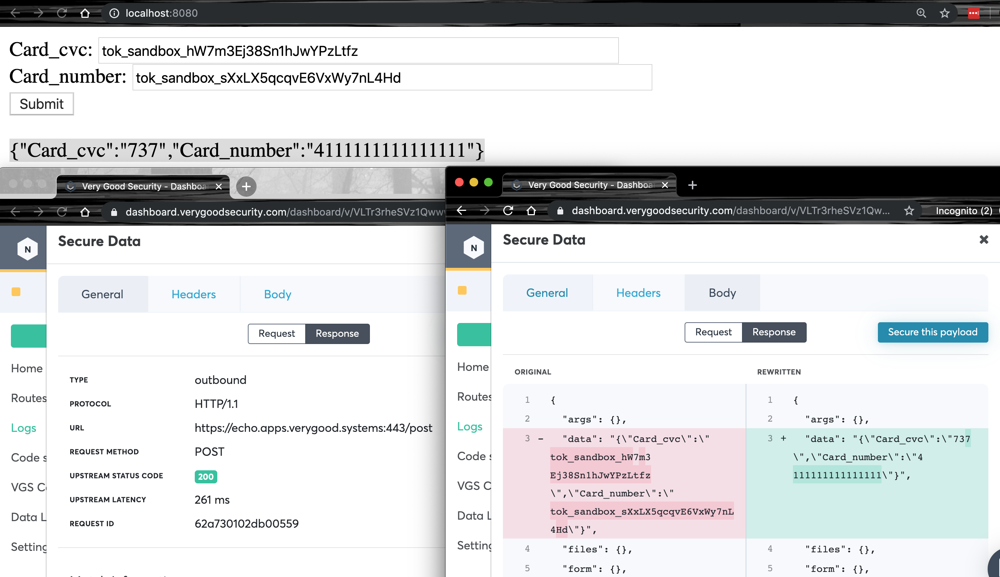

## Reveal data via VGS Forward Proxy

This project uses ASP.net with VGS in order to reveal sensitive information via a Forward Proxy. By not revealing `On request`, your servers never touch the data and only your customer's browser/client application will see the revealed information `On response`. The reponse is intercepted by VGS and the aliases are exchanged for the original content -- all before the customer sees it on their browser/client application.



Please follow the steps below, and read the additional details to ensure a successful implementation. If you have general questions around compliance in relation to revealing credit card information, please read our FAQs under the Compliance section __*[here](https://www.verygoodsecurity.com/docs/guides/faq#compliance)*__.


### SETUP
  __Step 1__: correctly specify the outbound route with your `Upstream Host` to your server or 3rd party, set the path `/post` for your server or 3rd party, and remember to set the `REVEAL` `On response` to ensure only the customer's browser/client application sees the revealed values for the fields `Card_cvc` and `Card_number`. Please feel free to upload the `outbound-reveal-cvc-card.yaml` file to properly configure the outbound, and set your `Upstream Host` to our echo server (`https://echo.apps.verygood.systems`).

  __Step 2__: before you can proceed, please create your aliases for the CVC and Credit Card Number. This can be accomplished either by VGS Collect, or with a test client -- see our `Code snippets` section within your VGS Dashboard.

  __Step 3__: you'll need to update the controller (i.e. `PostController.cs`) file with your Upstream Host and credentials.

  *Update your contoller with your `username`, `password`, and `tenant id` from within your VGS Dashboard.*
  ```
  NetworkCredential credentials = new NetworkCredential("<username>", "<password>");
  WebProxy proxy = new WebProxy("http://<tenant id>.sandbox.verygoodproxy.com:8080", false);
  ```
  *Remember to update the server with the `Upstream Host` and to reveal `On response`, feel free to test with our echo server like below.*
  ```
  HttpResponseMessage response = await httpClient.PostAsync("https://echo.apps.verygood.systems/post", content);
  ```

  __Step 4__: Open a terminal to the base of your project with the Dockerfile, run `docker build -t vgs-card-example-asp-net .`.

  __Step 5__: next run `docker run -d -p 8080:80 --name myapp vgs-card-example-asp-net`.

  __Step 6__: You are now in detached mode with your container, you can now open a browser and go to `localhost:8080` in order to enter an alias for the CVC and the Credit Card Number. If you go to your `Logs` and enable `Record payloads` from with the VGS dashboard, then you can confirm that the reveal is happening on response.
  *NOTE*: this is PCI Compliant on your side because as noted before you are revealing `On response`, so your server doesn't see the sensitive information and only the browser/client application the customer is using will see the response (i.e. `index.cshtml`).

  __Step 7__: Once you are done, you can disable the app by running `docker stop myapp`. Feel free to come back to the app by running `docker start myapp`.


### IMPORTANT DETAILS
Microsoft Visual Studio comes with Docker integration available, click __*[here](https://tutorials.visualstudio.com/aspnet-container/containerize)*__ to see how to containerize your project.

To successfully implement the Forward Proxy, please read the notes below to ensure you project is setup correctly.
  - In order to properly have your project work with the VGS Forward Proxy, you will need to have the `cert.pem` file, see your VGS Dashboard under the Code snippets section, included in your project. For example, you'll need to copy the `cert.pem` file into the Docker container. Please add towards the top of your Dockerfile the lines below.
    ```
    WORKDIR /usr
    COPY cert.pem /usr/local/share/ca-certificates/cert.crt
    RUN update-ca-certificates
    ```

  - If you come across an error of `Program does not contain a static 'Main' method suitable for an entry point` while containerizing your project, please move your Dockerfile up a level from the folder with your `.csproj` file. When you first create your Dockerfile, Visual Studo will place the Dockerfile in the same directory as your `.csproj` file.